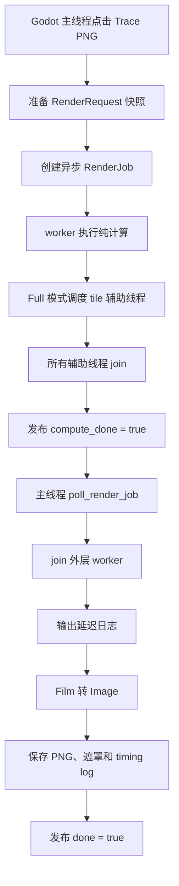
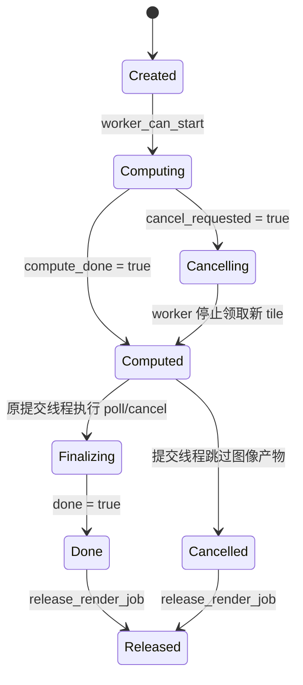

# REQ-005：多线程日志与异步导出主线程收尾说明

这份文档解释 `REQ-005` 解决了什么问题、为什么要这样设计，以及应该按什么顺序阅读相关源码。

如果只想先记住结论，可以记住下面三句话：

1. 光线追踪计算可以在多个线程执行，但多个计算线程不能调用 Godot 日志 API。
2. 异步 worker 只负责纯计算，不创建 `Image`，也不通过 `FileAccess` 写文件。
3. PNG、遮罩、耗时日志和异步单线程日志，都由创建任务的原提交线程在轮询时完成。

## 1. 先认识几个概念

### 1.1 提交线程

提交线程是调用 `start_render_scene_to_png_with_options()` 创建异步任务的线程。编辑器插件正常使用时，它就是 Godot 主线程。

请求创建时会记录 `std::thread::id`：

```text
RenderRequest.submission_thread_id
```

后续只有这个线程才能执行异步导出的最终收尾。这样即使其他线程调用了轮询接口，也不会在错误线程创建 Godot Object。

### 1.2 异步 worker

每个异步渲染任务有一个外层 worker。它负责：

- 重置 `CpuPathTracer`；
- 构建加速结构；
- 调度 pixel、tile 或 full 渲染；
- 汇总纯数据统计；
- 把计算结果交还给提交线程。

它不负责创建图片或写文件。

### 1.3 计算辅助线程

Full 模式会把图像切成 `16 × 16` 的 tile。异步 worker 自己也参与计算，其余计算线程是辅助线程。

目标计算线程数为：

```text
max(1, 本机逻辑线程数 - 1)
```

实际线程数还会被 tile 数封顶。例如只有一个 tile 时，只需要一个计算线程。

### 1.4 Godot Object 与纯计算数据

这里需要特别区分两类数据：

| 类型 | 示例 | worker 是否可以使用 |
| --- | --- | --- |
| 渲染器自有数据 | `Scene` 快照、`Camera` 快照、`Film`、triangle、统计结构 | 可以 |
| Godot Object | `Image`、`FileAccess`、`DirAccess`、场景树节点 | 只在提交线程使用 |

`String`、`Vector2i`、`Color` 等值类型会出现在请求快照里，但 worker 不会通过它们调用编辑器或文件系统 Object。

## 2. 原来的崩溃是怎么发生的

原来的 integrator 在追踪每条路径时直接调用：

```text
Logger::info(...)
```

`Logger::info()` 最终会进入 Godot 的 `UtilityFunctions::print()`。在编辑器中，这条调用还会经过 `EditorNode` 的日志处理器。

崩溃转储中的关键调用链是：

```text
RandomWalkIntegrator::trace
  -> Logger::info
  -> UtilityFunctions::print
  -> EditorNode::_print_handler
  -> Callable::get_object
  -> _purecall
  -> abort
```

Full 模式会同时运行多个计算线程。多个 worker/helper 从非主线程进入 Godot 编辑器日志系统后，可能访问不适合跨线程使用的编辑器对象，于是发生崩溃。

这次问题并不是 Film 越界，也不是 tile 重叠，而是计算线程越过了线程边界，调用了 Godot 日志 API。

## 3. 新的整体流程

修改后，异步渲染被拆成“纯计算”和“提交线程收尾”两个阶段。



最重要的边界是：

```text
compute_done = true
```

只表示计算已经结束，不表示 PNG 已经保存。

```text
done = true
```

表示提交线程已经完成图片创建、文件保存和最终结果发布。

## 4. 日志策略

日志策略定义在：

```text
src/render/render_execution_policy.h
src/render/render_execution_policy.cpp
```

它有三个状态：

| 计算线程数 | 当前是否为提交线程 | 策略 | 行为 |
| ---: | --- | --- | --- |
| 0 | 任意 | `Disabled` | 不记录日志 |
| 1 | 是 | `Direct` | 直接调用 `Logger` |
| 1 | 否 | `Deferred` | 只保存文本，提交线程稍后输出 |
| 2 或更多 | 任意 | `Disabled` | 不构造文本，也不调用日志 API |

### 4.1 为什么多线程不仅“不输出”，还要“不构造”

逐光线日志位于 per-ray/per-bounce 热路径。如果只禁止最终输出，但仍然拼接 `String`，大量光线仍会产生明显的字符串分配和格式化开销。

因此 integrator 会先判断有没有 log sink：

```cpp
if (has_log_sink()) {
    log_info(/* 构造消息 */);
}
```

多线程状态没有 sink，代码不会进入消息构造分支。

### 4.2 为什么异步单线程要延迟日志

异步任务即使只有一个计算线程，这个线程仍然是 worker，而不是 Godot 主线程。

所以它不能直接调用 `Logger`。它只把日志文本加入 `RenderComputation.deferred_logs`，等主线程收尾时再逐条调用 `Logger::info()`。

### 4.3 log sink 是怎么传递的

log sink 的传递路径是：

```text
RayTraceExporter
  -> CpuPathTracer::set_log_sink()
  -> Integrator::set_log_sink()
  -> RandomWalkIntegrator::trace()
```

`CpuPathTracer` 可能在 reset 或设置加速结构时重建 integrator，所以它会保存 sink，并在每次重建后重新设置给新的 integrator。

## 5. 异步任务里的三个核心结构

### 5.1 `RenderRequest`

`RenderRequest` 是提交时生成的请求快照，包含：

- 提取后的渲染场景；
- 渲染相机；
- 图像尺寸、采样数、最大深度和 seed；
- 输出后处理参数；
- 输出文件路径；
- 提交线程 ID；
- 已经发生的前置阶段耗时。

worker 读取快照，而不是继续访问实时 Godot 场景树。

### 5.2 `RenderComputation`

`RenderComputation` 是纯计算阶段的交接对象，包含：

- 初步 `RenderOutcome`；
- 持有 Film 的 `CpuPathTracer`；
- 异步单线程产生的延迟日志；
- 计算是否完整结束。

worker 把它交给 `RenderJob` 后，提交线程就能在不重新计算的情况下把 Film 转成图片。

### 5.3 `RenderJob`

`RenderJob` 是跨多次 API 调用保存的任务状态，关键字段包括：

```text
cancel_requested  是否请求取消
compute_done      纯计算是否结束
done              主线程收尾是否结束
tiles_done        已完成 tile 数
total_tiles       总 tile 数
computation       等待主线程接管的计算结果
outcome           对外返回的结果
```

## 6. 任务状态变化



### 为什么进度可能是 100%，但 `done` 仍然是 false

`tiles_done == total_tiles` 只说明所有 tile 已经计算完成。此时 PNG 可能还没有生成，因为主线程尚未执行下一次 poll。

这是有意设计的：只有 Godot Object 收尾也成功后，任务才真正完成。

## 7. 主线程和 worker 的职责表

| 阶段 | 执行线程 | 主要操作 |
| --- | --- | --- |
| 输入校验 | 提交线程 | 校验 root、camera、尺寸、模式和坐标 |
| 输出目录准备 | 提交线程 | 使用 `DirAccess` 创建目录 |
| 场景提取 | 提交线程 | 读取 Godot 场景树并生成纯数据快照 |
| 相机与 Environment 快照 | 提交线程 | 读取 Camera、Viewport、World3D、Environment |
| tracer reset/build | worker | 初始化渲染器和加速结构 |
| pixel/tile/full 计算 | worker 与辅助线程 | 生成光线、求交、着色、写入 Film |
| 统计归并 | worker 与辅助线程 | tile 本地累计，完成时加锁归并 |
| 外层 worker join | 提交线程 | 等待纯计算线程彻底退出 |
| 延迟日志输出 | 提交线程 | 调用 Godot `Logger` |
| Film 转图片 | 提交线程 | 创建和写入 `Image` |
| 保存文件 | 提交线程 | 保存主 PNG、遮罩、tile debug、timing log |
| 发布最终结果 | 提交线程 | 写入 outcome，设置 `done=true` |

## 8. Full 模式如何使用线程

Full 模式按 tile 数和本机线程数计算实际线程数：

```text
目标线程数 = max(1, hardware_concurrency - 1)
实际线程数 = min(目标线程数, tile 数)
```

例如本机有 20 个逻辑线程、图像有 2964 个 tile：

```text
目标计算线程数 = 19
实际计算线程数 = 19
```

异步 worker 本身算其中一个计算线程，因此还会创建最多 18 个辅助线程，而不是 worker 之外再创建 19 个。

每个辅助线程通过一个原子递增索引领取 tile。一个 tile 只会被领取一次，不同 tile 覆盖互不重叠的像素，所以 Film 写入不需要给每个像素加全局锁。

## 9. 取消是怎么处理的

取消采用协作式设计：

1. `cancel_render_job()` 设置 `cancel_requested=true`；
2. 调度器在领取 tile 前以及领取后、执行前检查取消；
3. 已经开始的 tile 可以完成，但不会继续领取新的 tile；
4. worker 发布计算结果；
5. 提交线程收尾时再次检查取消；
6. 如果已取消，跳过主 PNG、命中遮罩和 tile debug 的创建与保存。

最后一次取消检查很重要。它覆盖了下面这个时间窗口：

```text
纯计算已经完成
    ↓
用户点击取消
    ↓
主线程尚未生成 Image
```

没有这次检查，就可能出现 UI 显示“已取消”，但文件仍然被写出的情况。

## 10. 如何理解 timing log

### 10.1 `total_ms`

`total_ms` 是从请求开始到最终收尾结束的实际墙钟时间，包括：

- 输入校验；
- 场景提取；
- worker 启动与计算；
- Film 转 Image；
- PNG 和 timing log 保存；
- 异步轮询带来的少量等待。

这是最接近“用户实际等待了多久”的指标。

### 10.2 `render_tiles_ms`

`render_tiles_ms` 是整个并行 tile 计算阶段的墙钟时间。所有辅助线程会在这个时间窗口内并行工作。

### 10.3 `intersection_ms`

`intersection_ms` 不是墙钟时间，而是每次 `intersect()` 和 `intersect_p()` 耗时在所有线程上的累计值。

例如 12 个线程同时各执行 1 秒求交：

```text
render_tiles_ms ≈ 1000
intersection_ms ≈ 12000
```

因此 `intersection_ms` 大于 `total_ms` 是正常现象。

以这次实际日志为例：

```text
render_tiles_ms = 8301.058
intersection_ms = 93514.366
```

二者相除：

```text
93514.366 / 8301.058 ≈ 11.27
```

可以粗略理解为：渲染阶段平均约有 11.27 个线程的时间花在求交工作上。它不是精确 CPU 利用率，因为单次计时也可能包含线程被操作系统暂停的时间。

### 10.4 常用指标应该怎么看

| 想了解的问题 | 建议观察的字段 |
| --- | --- |
| 用户一共等待多久 | `total_ms` |
| tile 并行计算多久 | `render_tiles_ms` |
| Film 转图片多久 | `film_to_image_ms` |
| PNG 压缩和保存多久 | `save_png_ms` |
| 所有线程累计做了多少求交工作 | `intersection_ms` |
| 是否所有 tile 都计算完成 | `tiles: 完成数/总数` |

## 11. 默认点击 Trace PNG 时会发生什么

编辑器插件当前默认配置为：

```text
samples_per_pixel = 16
max_depth = 4
tile_size = 16 × 16
render_mode = full
```

因此每个像素会产生 16 条主射线。每条主射线最多追踪 4 个路径段，并可能根据场景灯光额外产生阴影射线。

因为正常视口通常有多个 tile，Full 模式会进入多线程日志禁用策略，不会输出逐光线日志。

如果选择 Pixel 模式，采样数会被强制设为 1；因为只有一个计算工作单元，所以允许单线程日志。

## 12. 推荐的源码阅读顺序

### 第一步：日志策略

阅读：

```text
src/render/render_execution_policy.h
src/render/render_execution_policy.cpp
```

先理解为什么存在 `Direct`、`Deferred` 和 `Disabled` 三种状态。

### 第二步：integrator 如何使用 sink

阅读：

```text
src/render/integrators.h
src/render/integrators.cpp
```

重点寻找：

```text
TraceLogSink
set_log_sink
has_log_sink
log_info
```

观察日志消息为什么被包在 `has_log_sink()` 判断里面。

### 第三步：`CpuPathTracer` 如何保存 sink

阅读：

```text
src/render/cpu_path_tracer.h
src/render/cpu_path_tracer.cpp
```

重点理解 `rebuild_integrator()`：integrator 被重建后，sink 必须重新设置。

### 第四步：异步任务数据结构

阅读 `src/raytrace_exporter.cpp` 开头的：

```text
RenderRequest
RenderOutcome
RenderComputation
RenderJob
```

先理解这些结构分别属于“请求快照”“对外结果”“计算交接”和“跨调用任务状态”。

### 第五步：纯计算阶段

继续阅读：

```text
render_compute_thread_count
render_one_pass
compute_async_render_request
```

确认这个阶段没有 `Image::create_empty()`、`save_png()` 或 `FileAccess::open()`。

### 第六步：提交线程收尾

继续阅读：

```text
finalize_async_render_computation
make_job_status_locked
poll_render_job
cancel_render_job
```

重点观察：

- 如何比较当前线程与 `submission_thread_id`；
- 何时 join worker；
- 何时调用 `film_to_image()`；
- 何时设置 `done=true`。

### 第七步：测试

阅读：

```text
tests/render/parallel_task_scheduler_tests.cpp
tests/godot/req005_async_main_thread_finalize_smoke.gd
```

原生测试验证日志策略组合；Godot smoke 验证第一次 poll 前没有文件、poll 后才产生文件，以及计算后取消不会产生图像产物。

## 13. 必须保持的安全约束

后续如果继续修改这部分代码，需要保持以下不变量：

1. 多计算线程状态不能安装 trace log sink。
2. 没有 sink 时，不能在热路径提前构造日志字符串。
3. 异步 worker 不能调用 `Logger`、`Image`、`FileAccess` 或 `DirAccess`。
4. Film 只能在全部 tile 辅助线程 join 后读取。
5. 只有原提交线程可以执行异步最终收尾。
6. `done=true` 必须晚于图片与文件收尾。
7. 收尾前必须再次检查取消状态。
8. `intersection_ms` 必须继续被理解为累计工作量，而不是墙钟耗时。

## 14. 常见问题

### 为什么异步单线程日志不是立即出现？

因为计算发生在 worker。为了不让 worker 调用 Godot 日志 API，消息先存入纯数据容器，等提交线程 poll 时统一输出。

### 为什么 Full 模式看不到逐光线日志？

Full 模式通常使用两个及以上计算线程，按安全策略完全禁用逐光线日志。这也是修复编辑器崩溃的关键。

### 为什么 worker 已完成，任务还没有 `done=true`？

worker 完成只代表 `compute_done=true`。还需要提交线程创建 Image、保存文件并发布结果。

### 可以从其他线程调用 poll 吗？

其他线程可以读取已有状态，但不会执行最终收尾。任务必须由原提交线程再次 poll 或 cancel，才能创建 Godot Object 并进入最终完成状态。

### 为什么不把所有异步工作都放回主线程？

光线追踪是耗时最多的部分，适合放到 worker 和辅助线程。只把 Godot Object 与文件交互放回主线程，可以兼顾编辑器响应和线程安全。

## 15. 相关记录

- 完成需求记录：[`completed_requirements.md`](completed_requirements.md) 中的 `REQ-005`。
- 多线程 tile 调度背景：`REQ-002`。
- 中文注释规则：`REQ-003`、`REQ-004`。

